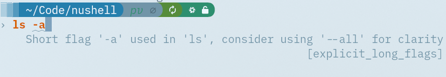
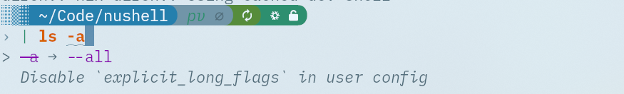
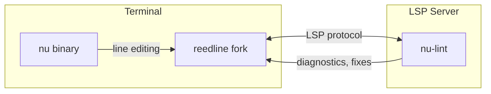

# nu-inline-diagnostics

Fork of [Nushell](https://github.com/nushell/nushell) that shows LSP diagnostics inline in the REPL as you type. It ships a generic LSP _client_ (in a forked `reedline`), so it is the opposite of the built-in `nu --lsp` server: instead of serving diagnostics, it consumes them from any language server and renders them under your input. Intended for use with [nu-lint](https://codeberg.org/wvhulle/nu-lint) but works with any LSP server.

> The installed binary is still called `nu`. `nu-inline-diagnostics` is only the package/flake name.

_Disclaimer: This fork was made to make it easier for people to experiment with inline diagnostics in the terminal for Nushell. As far as I know this is not too common yet. For the most-up-to date mainline Nushell features and development, please refer to the original repository. Otherwise, go ahead and play around with this fork._

Features:

- Multiple underlined spans
- Inline hints under spans
- Colors for warning / info / error level
- Automatic fixes (for most rules)
- User / workspace ignore action (for noisy rules)

Screenshot of inline diagnostics with multiple labels:



Screenshot of the code action menu being active and suggesting fixes:



## Architecture



The forked `reedline` adds an LSP client that communicates with one or more language servers configured via `$env.REEDLINE_LSP_SERVERS` (see [Usage](#usage)). Each server analyzes your input and returns diagnostics and code actions that are displayed inline.

## Installation

Install a language protocol server (LSP server). I recommend `nu-lint`:

```bash
cargo install nu-lint
```

Build the main binary `nu` with a Rust compiler toolchain:

- For Nix users: `nix run .` (or add this repo's flake to your system dependencies)
- Otherwise, if you are on a more mainstream machine, install `rustup` and:

```bash
cargo install --git https://github.com/wvhulle/nushell
```

Keep in mind this will overwrite any other `nu` binary you have there (such as the official one).

## Usage

Configure one or more language servers with `$env.REEDLINE_LSP_SERVERS`, a list of records. Each record takes a `command` (required) plus optional `language_id` (default `nushell`) and `uri_scheme` (default `file`):

```nu
$env.REEDLINE_LSP_SERVERS = [
    { command: "nu-lint --lsp", language_id: "nushell", uri_scheme: "repl" }
    # Add more servers here; diagnostics from all of them are shown inline.
]
```

Two fields drive how a server sees your input:

- **`language_id`** picks the file extension the input is presented as, so the server treats it as the right language: `nushell` → `.nu`, `bash` → `.sh`, `rust` → `.rs`, `python` → `.py`, and so on.
- **`uri_scheme`** picks the document URI:
  - `"file"` (default) presents the input as a real file `./.reedline-repl.<ext>` in the current directory. Use this for servers that resolve project config by path, such as **ast-grep** (it needs to find `sgconfig.yml`).
  - `"repl"` presents it as `repl:///repl.<ext>`. Use this for servers that filter out REPL-inappropriate actions, such as **nu-lint**.

### Examples

`nu-lint` linting your Nushell input (run from anywhere):

```nu
$env.REEDLINE_LSP_SERVERS = [
    { command: "nu-lint --lsp", language_id: "nushell", uri_scheme: "repl" }
]
```

[ast-grep](https://ast-grep.github.io/) with a rule set — run `nu` from inside the ast-grep project so `sgconfig.yml` resolves. Match `language_id` to the rules' `language:` field, e.g. bash rules ([ast-grep-git-to-jj](https://github.com/wvhulle/ast-grep-git-to-jj)):

```nu
$env.REEDLINE_LSP_SERVERS = [
    { command: "ast-grep lsp", language_id: "bash", uri_scheme: "file" }
]
```

...or Rust rules ([ast-grep-intro](https://github.com/wvhulle/ast-grep-intro)):

```nu
$env.REEDLINE_LSP_SERVERS = [
    { command: "ast-grep lsp", language_id: "rust", uri_scheme: "file" }
]
```

### Single-server shorthand

For one server you can use the simpler environment variables instead (a fallback used only when `REEDLINE_LSP_SERVERS` is unset). For `nu-lint`:

```nu
$env.REEDLINE_LS = "nu-lint --lsp"
$env.REEDLINE_LS_LANG = "nushell"   # default: nushell
$env.REEDLINE_LS_SCHEME = "repl"    # default: file
```

Run the shell: `~/.cargo/bin/nu` (or add to your path)

Key bindings:

- Open fix/ignore menu when a violation is detected with `ctrl+.`.
- Navigate between fixes and ignore actions: `tab`
- Apply fix directly in the prompt: `enter`

You can file issues related to incorrect lints and fixes at [nu-lint](https://codeberg.org/wvhulle/nu-lint).
